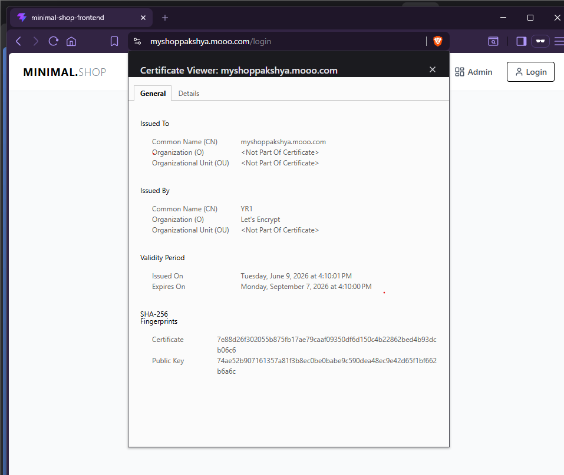

# Production-Grade Kubernetes Microservices Architecture
### GitOps | Automated CI/CD | High Availability & HPA | Zero-Trust TLS | Enterprise Observability

---

## 📌 Project Overview

This repository hosts a battle-tested, production-grade cloud-native e-commerce ecosystem named **MINIMAL.SHOP**. The primary objective of this project is to demonstrate an end-to-end operational lifecycle for containerized microservices. 

Instead of relying on managed cloud abstractions, this architecture features a multi-node, bare-metal-style cluster built completely from scratch using **kubeadm** on standalone cloud infrastructure. The deployment, configuration management, scaling, and self-healing behaviors are completely driven via **GitOps practices**—ensuring that the live cluster infrastructure is always a mirror image of the version-controlled declarative manifests.

### Core Architectural Pillars
* 🔄 **Declarative GitOps Continuous Delivery:** Zero manual `kubectl` application deployments. ArgoCD actively tracks Git repository drift to automatically sync, self-heal, and prune cluster states.
* 🛡️ **Automated Edge Security & TLS:** Dynamic, automated wildcard and domain-specific SSL/TLS certificate issuing via cert-manager leveraging Let’s Encrypt production ACME directories.
* 📈 **Elastic Horizontal Scaling:** Automated workload elasticity driven by cluster-resident Metrics Servers combined with Horizontal Pod Autoscalers (HPA) to scale application replicas under varying traffic spikes.
* 👁️ **Full-Stack Enterprise Telemetry:** Proactive, deep-cluster visibility utilizing Helm-deployed New Relic agents to orchestrate log forwarding, infrastructure tracking, and APM.

---

## 🏗️ System Architecture Blueprint

To capture the holistic view of traffic patterns, deployment pipelines, data management, and monitoring boundaries, the system is designed around the following architectural blueprint:

---

## 🛠️ The Tech Stack Matrix

| Component | Technology Solution | Functional Purpose |
| :--- | :--- | :--- |
| **Cloud Infrastructure** | AWS EC2 (Ubuntu 22.04 LTS) | Hosted virtual machines acting as control-plane and worker nodes. |
| **Container Runtime** | `containerd` | Low-level industry-standard container runtime for executing pod lifecycles. |
| **Orchestration Platform** | Kubernetes (`kubeadm` bootstrap) | Core cluster architecture, networking control plane, and API controller. |
| **Cluster Networking (CNI)**| Calico | Layer-3 networking fabric providing secure pod-to-pod communications. |
| **GitOps Engine** | ArgoCD (v3.4.3) | Continuous delivery controller enforcing state declaration synchronization. |
| **Ingress Control** | NGINX Ingress Controller | Layer-7 reverse proxy routing public incoming HTTP/HTTPS traffic to services. |
| **Automated Security** | cert-manager + Let's Encrypt | Dynamic X.509 certificate provisioning, renewal, and secret injection. |
| **Application Layer** | React, Node.js Microservices | Polyglot microservices managing decoupled functional business tasks. |
| **Stateful Database Layer** | MongoDB (`StatefulSet` + PVC) | Persistent, stable network identity datastore backed by storage volumes. |
| **Scaling Engine** | K8s Metrics Server + HPA | Real-time resource metrics collector driving automated horizontal pod replication. |
| **Observability Estate** | New Relic Operator & DaemonSets | Log streaming, infrastructure metrics collector, and topology engine. |

---
## 🧩 Step 2: Decoupling the Monolith into a Distributed Microservices Architecture

Transitioning from a legacy monolithic design to a cloud-native model requires breaking apart single-binary dependencies into loosely coupled, bounded contexts. For **MINIMAL.SHOP**, the backend domain was split into five specialized, independent microservices to enable isolated development cycles, independent scaling boundaries, and fault isolation.

Below is the conceptual blueprint of the decoupled service domains, structural environment mappings, and database integration layer:

---

### 1. Functional Microservices Breakdown
Every service operates as an isolated application layer with its own dedicated dependencies, packaged inside lightweight Docker containers:

* **`frontend` (React):** The client-facing user interface. It is served via an NGINX static file server inside the cluster and handles dynamic web requests by communicating directly with the backend APIs via public ingress routes.
* **`auth-service` (Node.js/Express):** Manages user registration, session validation, and secure JWT (JSON Web Token) generation and parsing.
* **`products-service` (Node.js/Express):** Acts as the catalog engine. It manages product listings, item descriptions, pricing, and metadata.
* **`cart-service` (Node.js/Express):** Handles stateful, temporary user sessions containing active shopping carts and item quantities before checkout processing.
* **`orders-service` (Node.js/Express):** Manages the checkout state machine, permanent order placement records, and histories.

---

### 2. Containerization & Versioned Image Management
Each microservice is built using a optimized multi-stage `Dockerfile` to keep image sizes minimal and secure. The images are compiled, tagged with specific semantic versions, and pushed to a central repository on **Docker Hub**. 

This version management strategy ensures that the GitOps controller can execute targeted, zero-downtime rolling updates whenever a specific service manifest is updated.

Here is the verified list of custom versioned images stored on Docker Hub ready for cluster deployment:

---

