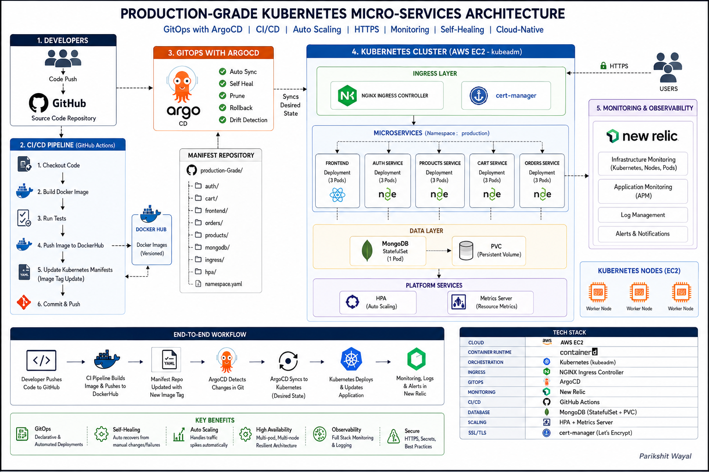

# Production-Grade Kubernetes Microservices Architecture
### GitOps | Automated CI/CD | High Availability & HPA | Zero-Trust TLS | Enterprise Observability

---

## 📌 Project Overview

This repository hosts a battle-tested, production-grade cloud-native e-commerce ecosystem named **MINIMAL.SHOP**. The primary objective of this project is to demonstrate an end-to-end operational lifecycle for containerized microservices. 

Instead of relying on managed cloud abstractions, this architecture features a multi-node, bare-metal-style cluster built completely from scratch using **kubeadm** on standalone cloud infrastructure. The deployment, configuration management, scaling, and self-healing behaviors are completely driven via **GitOps practices**—ensuring that the live cluster infrastructure is always a mirror image of the version-controlled declarative manifests.

### Core Architectural Pillars
* 🔄 **Declarative GitOps Continuous Delivery:** Zero manual `kubectl` application deployments. ArgoCD actively tracks Git repository drift to automatically sync, self-heal, and prune cluster states.
* 🛡️ **Automated Edge Security & TLS:** Dynamic, automated wildcard and domain-specific SSL/TLS certificate issuing via cert-manager leveraging Let’s Encrypt production ACME directories.
* 📈 **Elastic Horizontal Scaling:** Automated workload elasticity driven by cluster-resident Metrics Servers combined with Horizontal Pod Autoscalers (HPA) to scale application replicas under varying traffic spikes.
* 👁️ **Full-Stack Enterprise Telemetry:** Proactive, deep-cluster visibility utilizing Helm-deployed New Relic agents to orchestrate log forwarding, infrastructure tracking, and APM.

---

## 🏗️ System Architecture Blueprint

To capture the holistic view of traffic patterns, deployment pipelines, data management, and monitoring boundaries, the system is designed around the following architectural blueprint:



---

## 🛠️ The Tech Stack Matrix

| Component | Technology Solution | Functional Purpose |
| :--- | :--- | :--- |
| **Cloud Infrastructure** | AWS EC2 (Ubuntu 22.04 LTS) | Hosted virtual machines acting as control-plane and worker nodes. |
| **Container Runtime** | `containerd` | Low-level industry-standard container runtime for executing pod lifecycles. |
| **Orchestration Platform** | Kubernetes (`kubeadm` bootstrap) | Core cluster architecture, networking control plane, and API controller. |
| **Cluster Networking (CNI)**| Calico | Layer-3 networking fabric providing secure pod-to-pod communications. |
| **GitOps Engine** | ArgoCD (v3.4.3) | Continuous delivery controller enforcing state declaration synchronization. |
| **Ingress Control** | NGINX Ingress Controller | Layer-7 reverse proxy routing public incoming HTTP/HTTPS traffic to services. |
| **Automated Security** | cert-manager + Let's Encrypt | Dynamic X.509 certificate provisioning, renewal, and secret injection. |
| **Application Layer** | React, Node.js Microservices | Polyglot microservices managing decoupled functional business tasks. |
| **Stateful Database Layer** | MongoDB (`StatefulSet` + PVC) | Persistent, stable network identity datastore backed by storage volumes. |
| **Scaling Engine** | K8s Metrics Server + HPA | Real-time resource metrics collector driving automated horizontal pod replication. |
| **Observability Estate** | New Relic Operator & DaemonSets | Log streaming, infrastructure metrics collector, and topology engine. |

---
## 🧩 Step 2: Decoupling the Monolith into a Distributed Microservices Architecture

As the application grew, a monolithic architecture would have made deployments, scaling, and maintenance increasingly difficult. To align with cloud-native principles, **MINIMAL.SHOP** was re-architected into a collection of independent microservices, each responsible for a specific business capability.

This decomposition enables:

- Independent service deployments.
- Better fault isolation.
- Granular scaling of individual workloads.
- Improved maintainability and development velocity.
- Seamless integration with Kubernetes and GitOps workflows.

---

### Application Features

The following screenshots showcase the major functionalities provided by the microservices-based platform.

#### Shopping Cart

Managed by the Cart Service, responsible for maintaining user cart state and item quantities.

<br>


---

#### Order Management

Handled by the Orders Service, which manages order placement and purchase history.

<br>


---

#### User Authentication

Managed by the Authentication Service, providing secure login, registration, and JWT-based authentication.

<br>


---

#### Product & Inventory Management

Provided by the Products Service, responsible for catalog and inventory operations.

<br>


---

### Microservices Architecture Overview

The diagram below illustrates the separation of services, configuration management, and database integration across the platform.

<br>


---

### Functional Microservices Breakdown

Each service is packaged and deployed independently inside Kubernetes containers.

| Service | Responsibility |
|----------|---------------|
| **frontend** | React-based user interface served through NGINX. |
| **auth-service** | User registration, authentication, and JWT management. |
| **products-service** | Product catalog, pricing, and inventory management. |
| **cart-service** | Shopping cart operations and temporary user cart state. |
| **orders-service** | Checkout workflows, order creation, and order history. |

---

### Service Communication Flow

```text
Frontend
   │
   ├── Auth Service
   ├── Products Service
   ├── Cart Service
   └── Orders Service
```

The frontend interacts with each backend service through dedicated REST APIs, ensuring clear separation of responsibilities across the application.

---

### Outcome

By decomposing the monolithic application into independent microservices, the platform gained:

- Better scalability.
- Independent deployment cycles.
- Improved fault isolation.
- Easier maintenance and troubleshooting.
- A solid foundation for Kubernetes-based orchestration and cloud-native operations.

This architecture enables each business domain to evolve and scale independently while maintaining a cohesive user experience.

---

### 2. Containerization & Versioned Image Management
Each microservice is built using a optimized multi-stage `Dockerfile` to keep image sizes minimal and secure. The images are compiled, tagged with specific semantic versions, and pushed to a central repository on **Docker Hub**. 

This version management strategy ensures that the GitOps controller can execute targeted, zero-downtime rolling updates whenever a specific service manifest is updated.

Here is the verified list of custom versioned images stored on Docker Hub ready for cluster deployment:


<br>
<br>
<br>


---
## 🚀 Step 3: Declarative Application Deployments & Internal Service Networking

With the microservices split into distinct codebases and their container versions pushed to Docker Hub, the next phase is establishing their runtime state within the cluster. This is managed under the dedicated `production` namespace using zero-downtime `Deployment` policies and stable internal `ClusterIP` network abstractions.

---

### 1. Pod Replica Configuration & Deployment Strategy
Each stateless microservice deployment (such as `auth-service`, `cart-service`, `products-service`, and `orders-service`) is configured with a baseline of **3 replicas** distributed across the cluster nodes to ensure high availability. 
<br>


<br>
#### Sample Core Manifest Design (`auth/deployment.yaml`) and (auth/service.yml)
To give insight into the structural setup, the services utilize specific environment bindings to talk to the unified data tier safely:

<br>


<br>
<br>

<br>

---

## 🌐 Step 4: External Ingress Routing, FreeDNS, & Automated HTTPS via Let's Encrypt

Exposing internal `ClusterIP` services securely to the public internet requires an edge management plane. This architecture utilizes FreeDNS for public domain resolution, an **NGINX Ingress Controller** for Layer-7 traffic routing, and **cert-manager** linked with **Let's Encrypt** to automate end-to-end TLS termination.

---

### 1. Public DNS Record Configuration
To bridge public internet traffic to our AWS cluster gateway, custom dynamic Type A records were configured using the FreeDNS registry framework. These point directly to the public IP address of the cluster ingress entry-point:

* **E-Commerce Application URL:** `myshoppakshya.mooo.com`
* **GitOps Dashboard URL:** `argocd-pakshya.mooo.com`


<br>
<br>


<br>

Below is the active DNS zones panel routing configuration:


<br>
---

### 2. Layer-7 Traffic Routing with NGINX Ingress Controller

After external traffic enters the Kubernetes cluster through the cloud Load Balancer, the **NGINX Ingress Controller** serves as the centralized Layer-7 (Application Layer) gateway. It inspects incoming HTTP/HTTPS requests and intelligently routes them to the appropriate backend microservices based on the requested **hostname** and **URL path**.

Unlike traditional Layer-4 load balancing that routes traffic only using IP addresses and ports, the Ingress Controller performs **content-aware routing**, enabling multiple services to be exposed through a single domain while maintaining a clean and scalable architecture.

#### Key Responsibilities of the NGINX Ingress Controller

- Acts as the single entry point for external traffic.
- Routes requests using host-based and path-based rules.
- Provides SSL/TLS termination for secure HTTPS communication.
- Reduces the need for exposing individual services publicly.
- Simplifies traffic management across multiple microservices.
- Integrates seamlessly with Cert-Manager for automated certificate management.

---

### Production Traffic Flow

The following diagram represents the logical request flow:

```text
Client Browser
       │
       ▼
Cloud Load Balancer
       │
       ▼
NGINX Ingress Controller
       │
       ├── /               → Frontend Service
       ├── /api/auth       → Auth Service
       ├── /api/products   → Products Service
       ├── /api/cart       → Cart Service
       └── /api/orders     → Orders Service
```

For example:

- `https://myshoppakshya.mooo.com/` → Frontend Application
- `https://myshoppakshya.mooo.com/api/auth/login` → Authentication Service
- `https://myshoppakshya.mooo.com/api/products` → Products Service
- `https://myshoppakshya.mooo.com/api/cart` → Cart Service
- `https://myshoppakshya.mooo.com/api/orders` → Orders Service

This approach allows all application components to be accessed through a single domain while keeping the backend services isolated within the Kubernetes cluster.

---

#### Production Traffic Path Definitions (`production-ingress.yaml`)

```yaml
apiVersion: networking.k8s.io/v1

# Defines the Kubernetes resource type
kind: Ingress

metadata:
  # Name of the Ingress resource
  name: shop-ingress

  # Namespace where the Ingress resource exists
  namespace: production

spec:
  # Specifies that the NGINX Ingress Controller should manage this resource
  ingressClassName: nginx

  # Host and path-based routing rules
  rules:
  - host: myshoppakshya.mooo.com
    http:
      paths:

      # Frontend Application Route
      - path: /
        pathType: Prefix
        backend:
          service:
            name: frontend
            port:
              number: 80

      # Authentication Service Route
      - path: /api/auth
        pathType: Prefix
        backend:
          service:
            name: auth-service
            port:
              number: 5001

      # Products Service Route
      - path: /api/products
        pathType: Prefix
        backend:
          service:
            name: products-service
            port:
              number: 5002

      # Cart Service Route
      - path: /api/cart
        pathType: Prefix
        backend:
          service:
            name: cart-service
            port:
              number: 5003

      # Orders Service Route
      - path: /api/orders
        pathType: Prefix
        backend:
          service:
            name: orders-service
            port:
              number: 5004
```

---

### Verifying Service Endpoints

After deploying the services, Kubernetes automatically creates corresponding endpoints that map each Service to the underlying application Pods.

The following output confirms that all production services have active endpoints and are ready to receive traffic routed through the Ingress Controller.

<br>


---

### Verifying Ingress Configuration

The following command can be used to inspect the deployed Ingress resource:

```bash
kubectl get ingress -n production
```

This confirms:

- The configured hostname.
- The assigned external IP address.
- Active routing rules.
- Successful association with the NGINX Ingress Controller.

<br>


---

### Automated TLS Certificate Management with Cert-Manager

To secure application traffic, **Cert-Manager** is deployed within the cluster and configured with a **ClusterIssuer** resource.

The ClusterIssuer is responsible for:

- Requesting TLS certificates from Let's Encrypt.
- Performing domain ownership validation.
- Automatically issuing certificates.
- Renewing certificates before expiration.
- Eliminating manual certificate management.

This ensures all application traffic is encrypted using HTTPS.

<br>


<br>


---

### Cert-Manager Operational Verification

The following output confirms that all Cert-Manager components are running successfully within the cluster.

Healthy Cert-Manager pods indicate that:

- Certificate issuance is operational.
- Automatic certificate renewals are active.
- HTTPS traffic can be maintained without manual intervention.

<br>


<br>
<br>


---

### Outcome

At this stage, the production environment has a fully functional Layer-7 routing architecture where:

- External traffic enters through a single public endpoint.
- NGINX Ingress Controller performs intelligent path-based routing.
- Backend microservices remain private inside the cluster.
- TLS certificates are automatically managed by Cert-Manager.

<br>


## 📈 Step 5: High Availability Validation & Dynamic Scaling (HPA & Metrics Server)

In a production environment, application traffic is rarely constant. User activity can fluctuate significantly due to peak usage hours, marketing campaigns, seasonal demand, or unexpected traffic spikes. To ensure the platform remains responsive and highly available under varying workloads, Kubernetes provides **Horizontal Pod Autoscaling (HPA)**.

The HPA continuously monitors resource utilization and automatically adjusts the number of running pod replicas based on predefined scaling policies. This eliminates the need for manual intervention while ensuring efficient resource consumption and application availability.

To enable autoscaling, Kubernetes requires a centralized metrics collection component known as the **Metrics Server**.

---

### Why Horizontal Pod Autoscaling?

Without autoscaling:

- Traffic spikes can overwhelm application pods.
- Response times increase under heavy load.
- Services may become unavailable due to resource exhaustion.
- Manual scaling operations become operationally expensive.

With HPA enabled:

- Pods automatically scale out during increased demand.
- Pods scale back in when traffic decreases.
- Cluster resources are utilized more efficiently.
- Applications remain highly available and resilient.

---

### High-Level Autoscaling Architecture

The following workflow illustrates how Kubernetes performs dynamic scaling:

```text
Application Traffic
        │
        ▼
    Application Pods
        │
        ▼
    Kubelet Metrics
        │
        ▼
    Metrics Server
        │
        ▼
Horizontal Pod Autoscaler
        │
        ▼
Adjust Replica Count
        │
        ▼
Scale Up / Scale Down Pods
```

The Metrics Server collects resource usage data from every node's kubelet and exposes those metrics through the Kubernetes Metrics API. The HPA then evaluates this data and automatically adjusts deployment replica counts based on configured thresholds.

---

### 1. Deploying the Kubernetes Metrics Server

The **Metrics Server** is a cluster-wide component responsible for aggregating CPU and memory usage metrics from Kubernetes nodes and pods.

These metrics are consumed by:

- Horizontal Pod Autoscalers (HPA)
- `kubectl top` commands
- Resource monitoring workflows
- Kubernetes resource optimization processes

Since this cluster was provisioned using **kubeadm** with self-signed certificates, the default Metrics Server deployment requires a small modification to allow communication with kubelets using insecure TLS validation.

---

#### Installing Metrics Server

Download the latest stable Metrics Server manifest:

```bash
wget https://github.com/kubernetes-sigs/metrics-server/releases/latest/download/components.yaml
```

Modify the deployment arguments to include:

```yaml
- --kubelet-insecure-tls
```

This flag allows Metrics Server to collect node metrics successfully in environments where kubelet certificates are not signed by a publicly trusted certificate authority.

Apply the updated manifest:

```bash
kubectl apply -f components.yaml
```

After deployment, Kubernetes creates the Metrics Server resources and begins collecting cluster-wide resource utilization data.

---

### Verifying Metrics Server Deployment

The following output confirms that the Metrics Server deployment is running successfully within the cluster.

A healthy Metrics Server deployment indicates that Kubernetes can collect real-time CPU and memory utilization metrics required for autoscaling decisions.

<br>


---

### Validating Cluster Resource Metrics

Once Metrics Server is operational, resource utilization can be queried using:

```bash
kubectl top nodes

kubectl top pods -n production
```

These commands provide real-time visibility into:

- Node CPU utilization
- Node memory consumption
- Pod-level resource usage
- Overall cluster health

The successful retrieval of these metrics confirms that the Metrics API is functioning correctly.

<br>


---

### 2. Configuring Horizontal Pod Autoscaling (HPA)

After enabling Metrics Server, Horizontal Pod Autoscalers can be attached to application deployments.

An HPA continuously monitors deployment resource utilization and dynamically adjusts replica counts based on configured thresholds.

For example:

```yaml
minReplicas: 2
maxReplicas: 10

targetCPUUtilizationPercentage: 70
```

Scaling behavior:

- CPU utilization below 70% → No scaling action.
- CPU utilization exceeds 70% → Additional pods are created.
- Traffic decreases → Excess replicas are automatically removed.

This ensures that the application maintains performance while minimizing unnecessary infrastructure costs.

---

### Verifying Horizontal Pod Autoscaler Status

The following command displays active autoscalers and their current scaling status:

```bash
kubectl get hpa -n production
```

The output provides:

- Current replica count
- Target CPU utilization
- Minimum replicas
- Maximum replicas
- Current scaling state

This confirms that Kubernetes is actively monitoring workloads and can automatically react to changing resource demands.

<br>


---

### Autoscaling Demonstration


To validate the HPA configuration, a workload was generated against the application services.

As CPU utilization increased:

1. Metrics Server collected updated resource metrics.
2. HPA detected utilization above the configured threshold.
3. Kubernetes automatically increased the deployment replica count.
4. Incoming traffic was distributed across newly created pods.
5. Application responsiveness remained stable despite increased load.

Once the load subsided, Kubernetes automatically scaled the deployment back down to conserve cluster resources.

The screenshot below demonstrates the autoscaling process in action.

<br>


---

### Outcome

At this stage, the Kubernetes platform provides automated workload elasticity and high availability capabilities:

- Metrics Server continuously collects cluster resource metrics.
- Horizontal Pod Autoscalers monitor application utilization.
- Pods automatically scale out during traffic spikes.
- Pods scale back in during periods of low demand.
- Application availability is maintained without manual intervention.
- Infrastructure resources are utilized efficiently.

This implementation ensures that the microservices platform can dynamically adapt to changing traffic patterns while maintaining performance, reliability, and operational efficiency.


# 👁️ Step 6: Monitoring & Observability with New Relic

To gain visibility into the health and performance of the Kubernetes cluster, **New Relic** was integrated using the official guided Kubernetes installation. This provides centralized monitoring for cluster resources, nodes, pods, workloads, and log ingestion without requiring manual instrumentation of individual services.

The integration enables:

- Cluster-wide infrastructure monitoring
- Kubernetes workload visibility
- Centralized log aggregation
- Node and pod performance metrics
- Real-time health dashboards
- Faster troubleshooting and incident analysis

---

## New Relic Integration

After creating a New Relic account, the Kubernetes integration was installed using the **guided setup provided by New Relic**. The installation automatically deployed the required agents and monitoring components into a dedicated namespace within the cluster.

The deployment included:

- New Relic Infrastructure Agent
- Kubernetes Integration
- Log Forwarding Agent
- Cluster Metadata Collection
- Node and Pod Monitoring

### Verifying New Relic Components

The following output confirms that all New Relic monitoring components were successfully deployed and running inside the cluster.


---

## Kubernetes Cluster Monitoring

Once connected, New Relic automatically discovered the Kubernetes environment and began collecting metrics from:

- Worker nodes
- Control plane components
- Deployments
- Pods
- Services
- Namespaces

The cluster overview dashboard provides a centralized view of resource utilization, workload health, and overall cluster status.


---

## Infrastructure Monitoring

New Relic continuously tracks infrastructure-level metrics including:

- CPU utilization
- Memory consumption
- Network throughput
- Disk usage
- Node health

This provides real-time visibility into the underlying Kubernetes infrastructure.


---

## Node-Level Visibility

Individual Kubernetes nodes can be inspected to analyze resource consumption and identify potential bottlenecks.

Metrics include:

- CPU usage
- Memory utilization
- Network activity
- Process information
- System health indicators


---

## Centralized Log Aggregation

In addition to infrastructure metrics, New Relic automatically collects container logs from Kubernetes workloads and forwards them to a centralized logging platform.

This enables:

- Real-time log monitoring
- Application troubleshooting
- Error investigation
- Log searching and filtering
- Correlation between logs and infrastructure metrics


---

## Outcome

The New Relic integration provides complete visibility across the Kubernetes environment:

- Centralized monitoring for cluster resources
- Real-time infrastructure and workload metrics
- Automated log collection and analysis
- Node and pod-level observability
- Faster troubleshooting and operational insights

This monitoring layer ensures the platform remains observable, maintainable, and production-ready as workloads scale across the cluster.

---

# 🔄 Step 7: GitOps Continuous Delivery with ArgoCD

To automate application deployments and eliminate manual Kubernetes operations, the platform uses **ArgoCD** as the GitOps engine. All Kubernetes manifests are stored in a Git repository, making Git the single source of truth for the entire cluster.

Whenever a change is pushed to the repository, ArgoCD automatically detects the update and synchronizes the cluster state with the desired configuration defined in Git.

This provides:

- Automated deployments
- Continuous synchronization
- Drift detection and self-healing
- Version-controlled infrastructure
- Zero manual `kubectl apply` operations

---

## ArgoCD Deployment

ArgoCD was deployed inside the Kubernetes cluster and exposed securely through an NGINX Ingress Controller using a custom domain and TLS certificate issued by Cert-Manager.

### ArgoCD Ingress Configuration

```yaml
apiVersion: networking.k8s.io/v1
kind: Ingress

metadata:
  name: argocd-ingress
  namespace: argocd

  annotations:
    cert-manager.io/cluster-issuer: letsencrypt-prod
    nginx.ingress.kubernetes.io/backend-protocol: "HTTP"

spec:
  ingressClassName: nginx

  tls:
  - hosts:
      - argocd-pakshya.mooo.com
    secretName: argocd-tls

  rules:
  - host: argocd-pakshya.mooo.com
    http:
      paths:
      - path: /
        pathType: Prefix
        backend:
          service:
            name: argocd-server
            port:
              number: 80
```

### Secure ArgoCD Access

The ArgoCD dashboard is accessible through HTTPS using a certificate automatically managed by Cert-Manager.


---

## Application Management

ArgoCD continuously monitors the Kubernetes manifests stored in Git and tracks the health and synchronization status of all application resources.

The resource tree below shows the complete dependency graph of the production application, including deployments, services, ingress resources, and supporting Kubernetes objects.


---

## Production Application Synchronization

Once deployed, ArgoCD continuously reconciles the cluster state against the Git repository.

The dashboard below shows the production application in a healthy and synchronized state.


---

## GitOps Deployment Demonstration

To validate the GitOps workflow, the frontend deployment manifest was intentionally modified in the Git repository.

The container image was changed from:

```yaml
image: parikshit1212/frontend
```

to:

```yaml
image: nginx:latest
```

After committing and pushing the updated manifest to GitHub, **no manual deployment commands were executed**.

ArgoCD automatically:

1. Detected the change in the repository.
2. Marked the application as OutOfSync.
3. Applied the updated deployment manifest.
4. Performed a rolling update of the frontend pods.
5. Restored the cluster to the desired state defined in Git.

When the application was refreshed, the frontend was replaced with the default NGINX welcome page, confirming that the deployment had been updated entirely through the GitOps pipeline.


---

## Benefits of the GitOps Workflow

- Git serves as the single source of truth.
- Infrastructure changes are version-controlled.
- Automated deployments reduce operational overhead.
- Configuration drift is automatically detected.
- Applications can self-heal when unexpected changes occur.
- Rollbacks become simple Git commits.

---

## Outcome

At this stage, the platform operates using a fully automated GitOps workflow:

- ArgoCD continuously monitors Git repositories.
- Kubernetes manifests are deployed automatically.
- Changes are propagated without manual intervention.
- Cluster state remains synchronized with Git.
- Deployments are auditable, repeatable, and reliable.

This approach ensures consistent and predictable application delivery while significantly simplifying Kubernetes operations.


    

